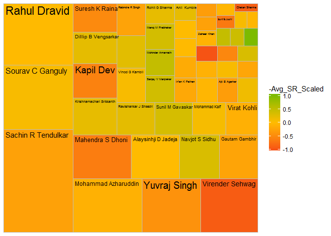
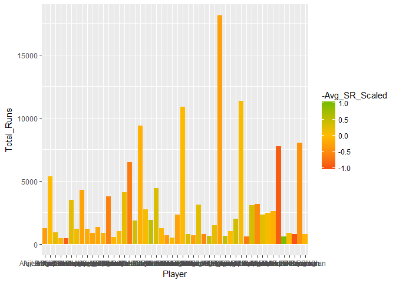
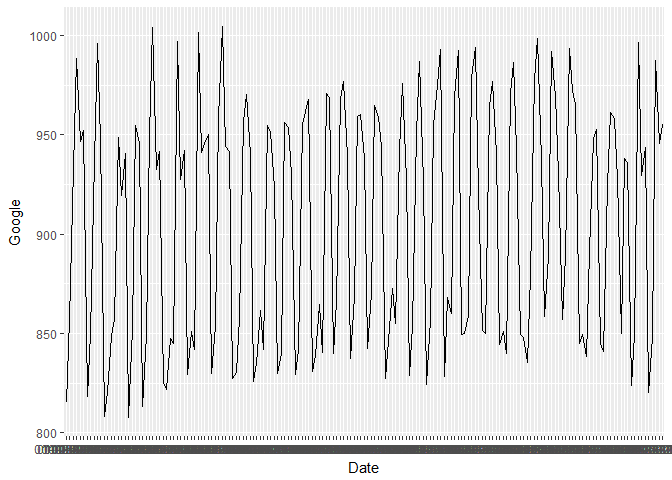
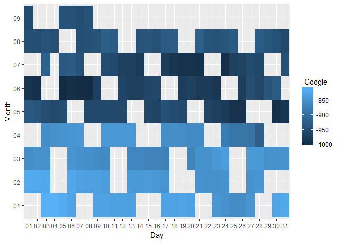
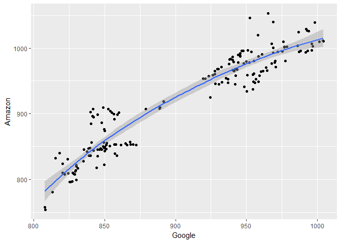
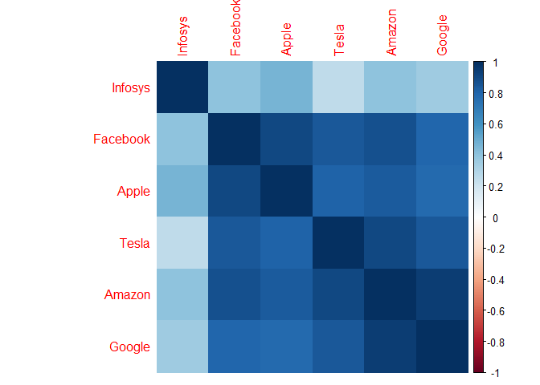

# Ipl-and-stock-data-analysis
Cricket And stock analysis
================
Archit Rao
9 November 2017

    ## 
    ## Attaching package: 'dplyr'

    ## The following objects are masked from 'package:stats':
    ## 
    ##     filter, lag

    ## The following objects are masked from 'package:base':
    ## 
    ##     intersect, setdiff, setequal, union

    ## [1]  1.0 -0.8 -1.0  0.2  0.8

    ##    Min. 1st Qu.  Median    Mean 3rd Qu.    Max. 
    ##   37.36   60.71   67.56   68.58   74.53   95.89



``` r
stock<-read.csv("C:/Users/Administrator/Desktop/Data visualisation/nasdaq.csv")

#separtae date month and year
Stock_new<-stock%>%mutate(Month=format(as.Date(Date,format="%d-%m-%Y"),"%m"),Day=format(as.Date(Date,format="%d-%m-%Y"),"%d"))%>%head(173)

#Create a bar chart
gl<-ggplot(Stock_new,aes(x=Date,y=Google))+geom_line(group=1)
plot(gl)
```



``` r
#create a heatmap
Stock_new%>%group_by()
```

    ## # A tibble: 173 x 9
    ##    Date       Amazon Google Facebook Apple Tesla Infosys Month Day  
    ##  * <fct>       <dbl>  <dbl>    <dbl> <dbl> <dbl>   <dbl> <chr> <chr>
    ##  1 03-01-2017   754.   808.     117.  116.  217.    14.7 01    03   
    ##  2 04-01-2017   757.   808.     119.  116.  227.    15.1 01    04   
    ##  3 05-01-2017   780.   813.     121.  117.  227.    15.0 01    05   
    ##  4 06-01-2017   796.   825.     123.  118.  229.    14.8 01    06   
    ##  5 09-01-2017   797.   827.     125.  119.  231.    15.0 01    09   
    ##  6 10-01-2017   796.   826.     124.  119.  230.    14.8 01    10   
    ##  7 11-01-2017   799.   830.     126.  120.  230.    15.2 01    11   
    ##  8 12-01-2017   814.   830.     127.  119.  230.    15.2 01    12   
    ##  9 13-01-2017   817.   831.     128.  119.  238.    14.5 01    13   
    ## 10 17-01-2017   810.   827.     128.  120.  236.    14.5 01    17   
    ## # ... with 163 more rows

``` r
ggplot(Stock_new,aes(y=Month,x=Day,fill=-Google))+geom_tile()
```



``` r
#corellation matrix
#install.packages("corrplot")
library(corrplot)
```

    ## corrplot 0.84 loaded

``` r
#coreation matrix
cor_values<-cor(select(head(stock,173),-Date))
#corrlation bw google and amazon
ggplot(Stock_new,aes(x=Google,y=Amazon))+geom_point()+geom_smooth()
```

    ## `geom_smooth()` using method = 'loess'



``` r
corrplot(cor_values,method="color",order="hclust")
```


